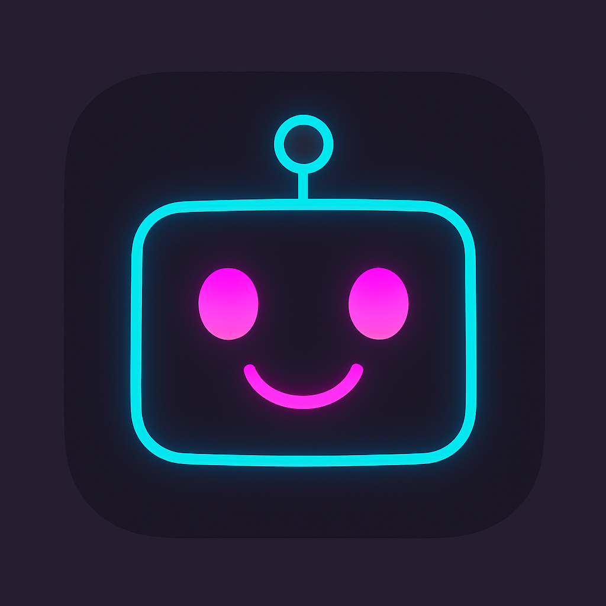

# 🤖 HazeBot Face App

A cute robot face app inspired by LOOI with expressive emotions, customizable colors, and speech capabilities! Built with Flutter using modern state management patterns.



## 📸 Screenshots

<div align="center">

### Different Face Types & Expressions


### Customization Options


</div>

## ✨ Features

### 🎭 **Expressive Emotions**
- **Happy** - Classic smile with smaller pupils
- **Surprised** - Wide eyes with oval mouth  
- **Sleepy** - Droopy pupils with straight line mouth
- **Excited** - Big pupils with rectangular grin
- **Confused** - Cross-eyed with wavy mouth

### 🎨 **Customization**
- **Eye Colors**: 8 different colors (cyan, blue, green, purple, orange, red, yellow, pink)
- **Mouth Colors**: 8 different colors with real-time preview
- **Face Types**: Multiple face styles including classic and LOOI-inspired designs

### ✨ **Animations & Interactions**
- **Automatic Blinking**: Natural blinking every 2-5 seconds
- **Touch Response**: Tap to cycle through expressions with bounce effect
- **Smooth Transitions**: Elastic animations for expression changes
- **Visual Feedback**: Glow effects when pressed

### 🗣️ **Speech Capabilities**
- Text-to-speech functionality
- Voice responses to interactions
- Customizable speech settings

### 🏗️ **Architecture**
- **State Management**: Flutter Bloc (Cubit) pattern
- **Code Generation**: Freezed for immutable data classes
- **Clean Architecture**: Separation of concerns with proper state management

## 🚀 Getting Started

### Prerequisites
- Flutter SDK (>=3.8.1)
- Dart SDK

### Installation

1. **Clone the repository**
   ```bash
   git clone <your-repo-url>
   cd haze_bot_app
   ```

2. **Install dependencies**
   ```bash
   flutter pub get
   ```

3. **Generate code (for Freezed models)**
   ```bash
   flutter packages pub run build_runner build
   ```

4. **Run the app**
   ```bash
   flutter run
   ```

## 🎮 How to Use

1. **Tap the robot face** to cycle through different expressions
2. **Tap the palette icon** (top-right) to customize colors
3. **Choose face type** from the settings menu
4. **Enable speech** to hear the robot respond to interactions

## 🏗️ Project Structure

```
lib/
├── main.dart                 # App entry point
├── cubits/                   # State management
│   ├── robot_face_cubit.dart
│   └── robot_face_state.dart
├── models/                   # Data models
│   └── robot_config.dart
├── widgets/                  # UI components
│   ├── robot_face_widget.dart
│   ├── classic_face.dart
│   └── looi_face.dart
└── painters/                 # Custom painters
    └── mouth_painter.dart
```

## 🛠️ Technologies Used

- **Flutter**: Cross-platform UI framework
- **Flutter Bloc**: State management
- **Freezed**: Code generation for immutable classes
- **Flutter TTS**: Text-to-speech functionality

## 🎨 Design Inspiration

- **LOOI App**: Horizontal robot face with expressive eyes
- **Fall Guys**: Cute bean-like character expressions
- **Vertical Layout**: Enhanced with mouth expressions for more personality

## 📱 Supported Platforms

- ✅ iOS
- ✅ Android
- ✅ Web
- ✅ macOS
- ✅ Windows
- ✅ Linux

## 🤝 Contributing

Feel free to contribute to this project! Whether it's:
- Adding new expressions
- Creating new face types
- Improving animations
- Adding sound effects

## 📄 License

This project is open source and available under the [MIT License](LICENSE).

---

Made with ❤️ and Flutter
